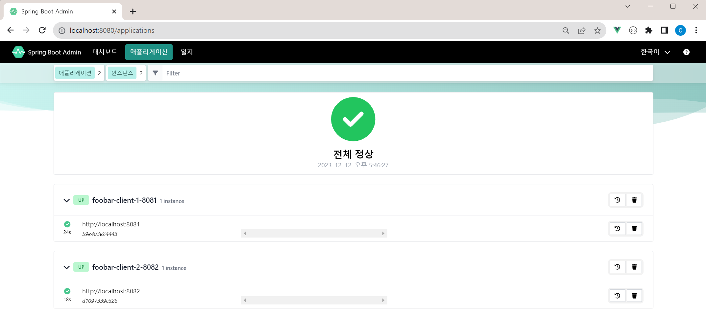

그라파나, 프로메테우스 등을 사용하는 것도 좋다. 다만 이번 글의 주제는 Spring Boot Admin Dashboard 다. 

 

### 주요 기술 의존성

- [spring boot admin - codecentric](https://github.com/codecentric/spring-boot-admin/)
- spring boot starter actuator
  - [maven - Spring Boot Starter Actuator](https://mvnrepository.com/artifact/org.springframework.boot/spring-boot-starter-actuator)
  - [docs.spring.io - Spring Boot Starter Actuator](https://docs.spring.io/spring-boot/docs/current/actuator-api/htmlsingle/)

 

### modules

- foobar-admin-server 
  - 어드민 대시보드
  - Port : 8080
- foobar-admin-client1
  - 어드민 클라이언트 1
  - Port : 8081
- foobar-admin-client2
  - 어드민 클라이언트 2
  - Port : 8082

 

### Screenshot

#### 대시보드

 

#### 상세페이지

##### 상세페이지 메인

 

##### Bean 선언된 내용들 확인

 

##### Configuration Properties

 

##### 스레드 덤프

 

##### Dispatcher Servet \> Handler Mapping

